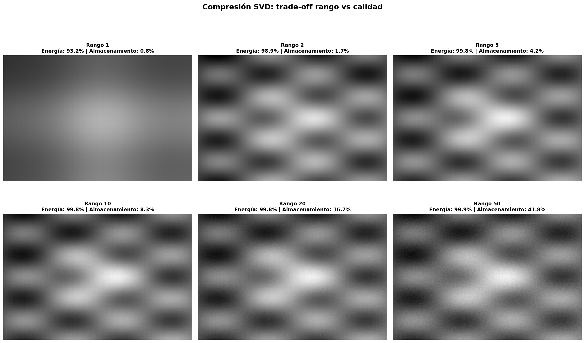

# Álgebra lineal visual con NumPy: qué hace geométricamente una matriz

Transformaciones lineales, valores propios y SVD implementados desde NumPy y visualizados en el plano: primero la ecuación, luego el código, luego el gráfico.

> **English summary.** Linear maps, eigendecomposition and SVD implemented from NumPy primitives (no ML libraries) and visualized in the plane. Seven families of 2D transformations with numerically verified properties (errors of order $10^{-16}$), complex eigenvalues of rotations, a non-diagonalizable shear, truncated-SVD image compression (98.86 % of the energy with $k = 2$) and an algebraic and numerical proof that PCA equals the SVD of centered data.

    [](https://colab.research.google.com/github/Eduardo0602/algebra-lineal-visual-numpy/blob/main/notebooks/01_transformaciones_lineales.ipynb)

## El problema

Muchas personas que se forman en ciencia de datos usan el álgebra lineal como una caja negra: llaman a `PCA()` o a `np.linalg.svd` sin saber qué hacen. Este proyecto muestra cada concepto como un objeto geométrico, lo implementa desde primitivas de NumPy y lo conecta con su uso en ciencia de datos (PCA, compresión, estabilidad numérica). El arco es progresivo: transformaciones, valores propios, SVD y PCA.

## Contenido

| Tema | Detalle |
|---|---|
| Transformaciones visualizadas | 7 familias: rotación, reflexión (3 tipos), escalado, proyección ortogonal, cizallamiento |
| Propiedades verificadas numéricamente | Ortogonalidad, involución, idempotencia, no conmutatividad, grupo de rotaciones |
| Valores propios | Polinomio característico, diagonalización, teorema espectral, valores propios complejos |
| SVD | Factorización completa, interpretación geométrica, teorema de Eckart–Young |
| Aplicación | Compresión de imágenes sintéticas (200×300 y 400×600 px), conexión SVD–PCA |

## Fundamento matemático

**Transformaciones lineales.** $T: \mathbb{R}^n \to \mathbb{R}^m$ es lineal si $T(\alpha \mathbf{u} + \beta \mathbf{v}) = \alpha\, T(\mathbf{u}) + \beta\, T(\mathbf{v})$ para todo $\mathbf{u}, \mathbf{v} \in \mathbb{R}^n$ y $\alpha, \beta \in \mathbb{R}$. Por el teorema de representación matricial existe una única $A \in \mathbb{R}^{m \times n}$ con $T(\mathbf{x}) = A\mathbf{x}$, cuyas columnas son las imágenes de los vectores canónicos: $A = [T(\mathbf{e}_1) \mid \cdots \mid T(\mathbf{e}_n)]$. El valor absoluto de $\det(A)$ es el factor de cambio de área y su signo indica si se conserva la orientación.

**Valores y vectores propios.** $\mathbf{v} \neq \mathbf{0}$ es vector propio de $A$ con valor propio $\lambda$ si $A\mathbf{v} = \lambda \mathbf{v}$. Los valores propios son las raíces de $p(\lambda) = \det(A - \lambda I)$, con $\sum_i \lambda_i = \text{tr}(A)$ y $\prod_i \lambda_i = \det(A)$. Si $A = A^\top$, el teorema espectral garantiza valores propios reales, vectores propios ortogonales y $A = \sum_i \lambda_i \mathbf{v}_i \mathbf{v}_i^\top$.

**Descomposición en valores singulares.** Toda $A \in \mathbb{R}^{m \times n}$ admite $A = U \Sigma V^\top$. La mejor aproximación de rango $k$ en norma de Frobenius es la SVD truncada (teorema de Eckart–Young):

$$A_k = \sum_{i=1}^{k} \sigma_i \mathbf{u}_i \mathbf{v}_i^\top, \qquad \|A - A_k\|_F = \sqrt{\sigma_{k+1}^2 + \cdots + \sigma_r^2}.$$

## Resultados

**Transformaciones en $\mathbb{R}^2$.** Se implementaron 7 familias, cada una con su matriz y su efecto sobre el cuadrado unitario. Las propiedades algebraicas se verificaron con errores del orden de $10^{-16}$: ortogonalidad ($R^\top R = I$), involución ($S^2 = I$) e idempotencia ($P^2 = P$). Rotar 45° y luego escalar difiere de escalar y luego rotar en hasta $1{,}06$: la no conmutatividad es visible y medible.

**Valores propios.** El polinomio característico calculado a mano coincide con `np.linalg.eig` (error $= 0$). El cizallamiento ilustra un caso no diagonalizable (multiplicidad geométrica menor que la algebraica) y la rotación de 45° produce valores propios complejos $e^{\pm i\pi/4}$: ningún vector real conserva su dirección. Aplicar $A$ repetidamente converge al vector propio dominante (principio del método de la potencia).

**SVD y compresión.** Toda transformación $2 \times 2$ equivale a rotación, escalado y rotación. En la imagen sintética de $200 \times 300$ px, $k = 2$ componentes capturan el **98,86 % de la energía** con el 1,7 % del almacenamiento. PCA y SVD coinciden algebraica y numéricamente: la primera componente explica el 81,4 % de la varianza y las varianzas por ambas vías difieren en menos de $5 \times 10^{-16}$.



## Verificación

Cada propiedad afirmada se comprueba numéricamente en los notebooks (ortogonalidad, involución, idempotencia, polinomio característico frente a `np.linalg.eig`, varianzas de PCA por SVD frente a la covarianza), con errores del orden de $10^{-16}$ o menores (exactamente $0$ en el polinomio característico).

## Cómo reproducir

```bash
git clone https://github.com/Eduardo0602/algebra-lineal-visual-numpy.git
cd algebra-lineal-visual-numpy
conda create -n ds_portafolio python=3.11 -y
conda activate ds_portafolio
pip install -r requirements.txt
jupyter lab   # abrir 01, 02 y 03 en orden: Kernel → Restart & Run All
```

| Notebook | Contenido |
|---|---|
| [`01_transformaciones_lineales.ipynb`](notebooks/01_transformaciones_lineales.ipynb) | Rotaciones, reflexiones, escalados, proyecciones y cizallamiento; composición y no conmutatividad (13 figuras) |
| [`02_valores_propios.ipynb`](notebooks/02_valores_propios.ipynb) | Polinomio característico, diagonalización, teorema espectral, valores propios complejos, convergencia al vector propio dominante (7 figuras) |
| [`03_svd_compresion.ipynb`](notebooks/03_svd_compresion.ipynb) | SVD, interpretación geométrica, compresión de imágenes, conexión SVD–PCA (9 figuras) |

## Estructura del proyecto

```
algebra-lineal-visual-numpy/
├── notebooks/            # 01 → 02 → 03
├── src/visualization.py  # dibujar_vector, configurar_ejes, comprimir_svd, slugify
├── reports/figures/      # 29 figuras en PNG
├── requirements.txt
└── LICENSE
```

## Limitaciones

- Todo ocurre en $\mathbb{R}^2$ y con imágenes sintéticas: el objetivo es la intuición geométrica, no el rendimiento con datos grandes.
- La compresión con SVD se compara por energía y error de Frobenius, no por calidad perceptual.

## Lo que aprendí

1. **El determinante es un objeto geométrico.** Mide cuánto cambia el área bajo la transformación y su signo codifica la orientación.
2. **La multiplicación matricial no es conmutativa, y eso importa.** Encadenar transformaciones en otro orden (preprocesamiento, PCA) cambia el resultado.
3. **Los vectores propios son las direcciones invariantes.** La definición algebraica y la geométrica son la misma cosa.
4. **Una rotación pura no tiene vectores propios reales.** Los valores propios complejos no son un problema técnico: son la señal de que ninguna dirección real se conserva.
5. **La no diagonalizabilidad es concreta.** El cizallamiento tiene $\lambda = 1$ con multiplicidad algebraica 2 y geométrica 1.
6. **La SVD generaliza la descomposición espectral a cualquier matriz**, cuadrada o no, singular o no.
7. **PCA es SVD de los datos centrados.** Por eso scikit-learn usa SVD: es más estable que diagonalizar $X^\top X$.
8. **El punto flotante es preciso pero no exacto.** Errores de $10^{-16}$ son inevitables; el oficio está en saber cuándo importan.

---

### Portafolio *De Matemático a Data Scientist*

| Proyecto | Pregunta | Herramientas |
|---|---|---|
| [Muestreo complejo con Ser Estudiante](https://github.com/Eduardo0602/muestreo-complejo-ser-estudiante) | ¿Cuánto se equivoca quien ignora el diseño muestral? | R, survey |
| [EDA con datos sucios: defunciones 2021](https://github.com/Eduardo0602/eda-limpieza-defunciones-ecuador-pandas-sql) | ¿Qué hay que corregir antes de confiar en un registro oficial? | Python, pandas, SQL |
| [Regresión lineal desde cero](https://github.com/Eduardo0602/regresion-lineal-numpy-desde-cero) | ¿Puede un plano predecir la profundidad de los sismos de Ecuador? | Python, NumPy |
| **Álgebra lineal visual** (este repositorio) | ¿Qué hace geométricamente una matriz? | Python, NumPy |

Eduardo Araque · Matemático (Universidad Central del Ecuador) · [GitHub](https://github.com/Eduardo0602) · [LinkedIn](https://www.linkedin.com/in/eduardo-araque-j%C3%A1come-311b93235)
